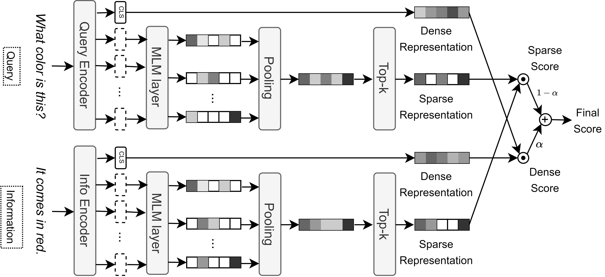

# Jointly Learning Lexical and Semantic Representations for Efficient and Interpretable Information Retrieval

This repository contains the official PyTorch implementation of the following paper:

> **Jointly Learning Lexical and Semantic Representations for Efficient and Interpretable Information Retrieval**<br>
>
> **Abstract:** *Expansion-enhanced sparse lexical representation has opened new avenues for lexical matching in information retrieval by minimizing vocabulary mismatch problems. However, the potentiality of jointly learning the dense semantic representation (a byproduct of such models) and combining it with the lexical one in ranking requires to be studied. In this work, we propose a hybrid information retrieval mechanism that combines lexical and semantic matching to maximize their capabilities while minimizing their shortcomings. Specifically, we present an architecture of dual hybrid encoders that can encode queries and information independently. Each encoder jointly learns a dense semantic representation and a sparse lexical representation augmented by a learnable term expansion of the corresponding text using contrastive learning. We demonstrate the efficacy of our model by using it to do single-stage ranking on a benchmark product question-answering dataset consisting of the heterogeneous information available on online product pages. Our evaluation indicates that the proposed hybridization outperforms the separately trained sparse or dense retrievers and provides better interpretability at a relatively smaller computational cost and memory footprint.*

# Framework 




# Environment
python==3.9.16
pytorch==2.0.0
python-dotenv yacs docopt flatten-json ranx transformers calflops nltk

Check ./requirements/

# TransICD

1. Run Experiments.
```
python HybridPQA/retriever_trainer.py
--path_output=./output/
--path_data=./data/evidence_ranking/
--path_cfg_exp=./HybridPQA/configs/retriever_config/experiments/hybrid.yaml
```


